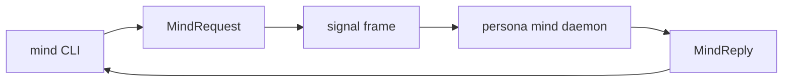
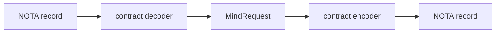

# signal-persona-mind — architecture

*Typed Signal contract for the command-line mind and `persona-mind`.*

---

## 0 · TL;DR

`signal-persona-mind` is the public vocabulary for Persona's central mind. It
defines the typed request/reply channel used by the `mind` CLI,
`tools/orchestrate` compatibility shim, and long-lived `persona-mind` daemon.

This repo owns records, validation newtypes, rkyv round trips, and channel
shape. It does not own the CLI binary, actors, database, storage tables,
transport lifecycle, or compatibility lock-file projection.



## 1 · Channel Boundary

| Side | Component |
|---|---|
| Request producer | `mind` CLI, `tools/orchestrate` shim, future hosts that speak the same channel. |
| Request consumer | `persona-mind` daemon. |
| Reply producer | `persona-mind` daemon. |
| Reply consumer | the caller that submitted the operation. |

The CLI text surface is one NOTA record in and one NOTA record out. That text
projection must decode into the same `MindRequest` enum declared here. It must
not create a second CLI-only command language.

Rust-to-Rust boundaries use `signal-core` frames carrying rkyv archives. The
same typed request/reply vocabulary underlies both the NOTA projection and the
binary frame projection.

The local transport between CLI and daemon belongs to `persona-mind`, not this
contract. The likely first transport is a Unix socket carrying `signal-core`
frames.

## 2 · Channel Declaration

The channel is one `signal_channel!` invocation in `src/lib.rs`.

```rust
signal_channel! {
    request MindRequest {
        RoleClaim(RoleClaim),
        RoleRelease(RoleRelease),
        RoleHandoff(RoleHandoff),
        RoleObservation(RoleObservation),
        ActivitySubmission(ActivitySubmission),
        ActivityQuery(ActivityQuery),
        Open(Opening),
        AddNote(NoteSubmission),
        Link(Link),
        ChangeStatus(StatusChange),
        AddAlias(AliasAssignment),
        Query(Query),
    }
    reply MindReply {
        ClaimAcceptance(ClaimAcceptance),
        ClaimRejection(ClaimRejection),
        ReleaseAcknowledgment(ReleaseAcknowledgment),
        HandoffAcceptance(HandoffAcceptance),
        HandoffRejection(HandoffRejection),
        RoleSnapshot(RoleSnapshot),
        ActivityAcknowledgment(ActivityAcknowledgment),
        ActivityList(ActivityList),
        Opened(OpeningReceipt),
        NoteAdded(NoteReceipt),
        Linked(LinkReceipt),
        StatusChanged(StatusReceipt),
        AliasAdded(AliasReceipt),
        View(View),
        Rejected(Rejection),
    }
}
```

Closed enums are intentional. There is no `Unknown` escape hatch. New
operations are schema changes coordinated through this contract.

## 3 · Record Families

### 3.1 Role coordination

| Request | Reply |
|---|---|
| `RoleClaim` | `ClaimAcceptance` or `ClaimRejection` |
| `RoleRelease` | `ReleaseAcknowledgment` |
| `RoleHandoff` | `HandoffAcceptance` or `HandoffRejection` |
| `RoleObservation` | `RoleSnapshot` |

These records replace the lock-file claim/release/handoff protocol. Lock files
may exist only as transitional local projections outside this contract.

### 3.2 Activity

| Request | Reply |
|---|---|
| `ActivitySubmission` | `ActivityAcknowledgment` |
| `ActivityQuery` | `ActivityList` |

Activity time is store-supplied. `ActivitySubmission` does not carry
`TimestampNanos`.

### 3.3 Work and memory graph

| Request | Reply |
|---|---|
| `Open` | `Opened` |
| `AddNote` | `NoteAdded` |
| `Link` | `Linked` |
| `ChangeStatus` | `StatusChanged` |
| `AddAlias` | `AliasAdded` |
| `Query` | `View` |

These records are the active native replacement for BEADS as a work/memory
graph. Imported BEADS IDs are represented as aliases or external references;
the contract does not model a live BEADS backend.

## 4 · Boundary Newtypes

The contract validates boundary strings before they become wire values.

| Type | Invariant |
|---|---|
| `RoleName` | closed role set: operator, operator-assistant, designer, designer-assistant, system-specialist, poet. |
| `WirePath` | absolute normalized slash-separated path; rejects `..`. |
| `TaskToken` | raw unbracketed token, non-empty, no whitespace or brackets. |
| `ScopeReason` | non-empty single-line text. |
| `TimestampNanos` | store-supplied timestamp type; request records do not mint it. |
| `ActorName` | event/caller identity after infrastructure resolution. |
| `StableItemId` | internal work graph identity. |
| `DisplayId` | short human identity for work graph references. |
| `ExternalAlias` | imported or external identifiers. |

Strings in `Title`, `Body`, and path-like wrappers are provisional where the
semantic shape is still evolving. They are still typed at the boundary; callers
do not pass unstructured maps.

## 5 · Text Projection

The required text surface is NOTA. Nexus may supply the semantic content shape
inside NOTA, but there is no second text syntax.

The projection is not implemented in this repo yet. When it lands, it should
round trip through these records directly:



Illustrative command shapes:

```text
(RoleClaim Operator ((Path "/git/github.com/LiGoldragon/persona-mind")) "implement command-line mind")
(Query Ready 20)
(Open Task High "wire command-line mind" "replace lock helper with typed state")
```

The exact spelling is a projection decision. The invariant is that the parsed
value is one of the `MindRequest` variants declared here.

## 6 · Versioning

`signal-core::Frame` carries protocol version. Schema changes that add/remove
variants or change fields require coordinated upgrades of producers and
consumers.

Backward compatibility is handled by explicit conversion code, not by weak
catch-all records.

## 7 · Tests

Existing tests in `tests/round_trip.rs` cover:

- request/reply frame round trips;
- role and activity variants;
- memory/work variants;
- every `QueryKind`;
- every `EdgeKind`;
- scope variants;
- external references;
- boundary validation.

Missing tests for the next wave:

| Test | Proves |
|---|---|
| `nota_projection_round_trips_role_claim` | text projection uses this contract. |
| `nota_projection_rejects_cli_only_command` | no second command language. |
| `request_payload_cannot_carry_timestamp` | store mints time. |
| `request_payload_cannot_carry_event_sequence` | store mints sequence. |

## 8 · Non-ownership

This repo does not own:

- `mind` binary implementation;
- Kameo actors;
- `mind.redb`;
- daemon lifecycle and local socket path;
- `persona-sema` / `sema` table declarations;
- caller identity resolution policy;
- time/ID minting policy;
- lock-file projection format;
- BEADS import code.

## Code Map

```text
src/lib.rs              payload records and signal_channel! declaration
tests/round_trip.rs     per-variant wire-form round trips and validation tests
```

## See Also

- `../persona-mind/ARCHITECTURE.md`
- `../signal-core/ARCHITECTURE.md`
- `~/primary/protocols/orchestration.md`
- `~/primary/reports/operator/105-command-line-mind-architecture-survey.md`
- `~/primary/skills/contract-repo.md`
