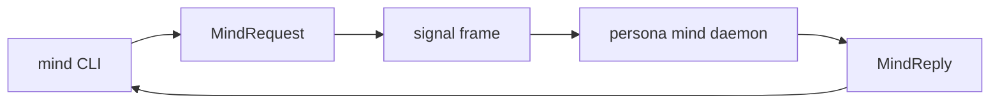
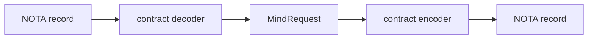

# signal-persona-mind — architecture

*Typed Signal contract for the command-line mind and `persona-mind`.*

---

## 0 · TL;DR

`signal-persona-mind` is the public vocabulary for Persona's central mind. It
defines the typed request/reply channel used by the `mind` CLI,
external `tools/orchestrate` cutover wrappers, and long-lived `persona-mind`
daemon.

> **Scope.** This contract sits on today's stack — `signal-core` wire,
> rkyv archives, `sema-db` storage in consumers. The
> eventually-self-hosting stack is Sema-on-Sema, in which signal-*
> as a separate vocabulary layer collapses. Today's contract is a
> realization step. See `~/primary/ESSENCE.md` §"Today and eventually".

This repo owns records, validation newtypes, rkyv round trips, and channel
shape. It does not own the CLI binary, actors, database, storage tables,
transport lifecycle, or lock-file migration.

It also owns the mapping from each `MindRequest` variant to the
`SignalVerb` root that frames it. Generic `Request::assert(payload)`
helpers are too permissive for component contracts; callers use
`MindRequest::signal_verb()` so graph creation, graph queries,
subscriptions, role release, and channel retraction cannot silently
travel as `Assert`.



## 1 · Channel Boundary

| Side | Component |
|---|---|
| Request producer | `mind` CLI, `tools/orchestrate` shim, future hosts that speak the same channel. |
| Request consumer | `persona-mind` daemon. |
| Reply producer | `persona-mind` daemon. |
| Reply consumer | the caller that submitted the operation. |

The CLI text surface is one NOTA record in and one NOTA record out. That text
projection must decode into the same `MindRequest` enum declared here. It must
not create a second CLI-only command language.

Rust-to-Rust boundaries use `signal-core` frames carrying rkyv archives. The
same typed request/reply vocabulary underlies both the NOTA projection and the
binary frame projection.

The local transport between CLI and daemon belongs to `persona-mind`, not this
contract. The likely first transport is a Unix socket carrying `signal-core`
frames.

## 2 · Channel Declaration

The channel is one `signal_channel!` invocation in `src/lib.rs`.

```rust
signal_channel! {
    request MindRequest {
        SubmitThought(SubmitThought),
        SubmitRelation(SubmitRelation),
        QueryThoughts(QueryThoughts),
        QueryRelations(QueryRelations),
        SubscribeThoughts(SubscribeThoughts),
        SubscribeRelations(SubscribeRelations),
        RoleClaim(RoleClaim),
        RoleRelease(RoleRelease),
        RoleHandoff(RoleHandoff),
        RoleObservation(RoleObservation),
        ActivitySubmission(ActivitySubmission),
        ActivityQuery(ActivityQuery),
        Opening(Opening),
        NoteSubmission(NoteSubmission),
        Link(Link),
        StatusChange(StatusChange),
        AliasAssignment(AliasAssignment),
        Query(Query),
        AdjudicationRequest(AdjudicationRequest),
        ChannelGrant(ChannelGrant),
        ChannelExtend(ChannelExtend),
        ChannelRetract(ChannelRetract),
        AdjudicationDeny(AdjudicationDeny),
        ChannelList(ChannelList),
    }
    reply MindReply {
        ThoughtCommitted(ThoughtCommitted),
        RelationCommitted(RelationCommitted),
        ThoughtList(ThoughtList),
        RelationList(RelationList),
        SubscriptionAccepted(SubscriptionAccepted),
        SubscriptionEvent(SubscriptionEvent),
        ClaimAcceptance(ClaimAcceptance),
        ClaimRejection(ClaimRejection),
        ReleaseAcknowledgment(ReleaseAcknowledgment),
        HandoffAcceptance(HandoffAcceptance),
        HandoffRejection(HandoffRejection),
        RoleSnapshot(RoleSnapshot),
        ActivityAcknowledgment(ActivityAcknowledgment),
        ActivityList(ActivityList),
        OpeningReceipt(OpeningReceipt),
        NoteReceipt(NoteReceipt),
        LinkReceipt(LinkReceipt),
        StatusReceipt(StatusReceipt),
        AliasReceipt(AliasReceipt),
        View(View),
        Rejection(Rejection),
        AdjudicationReceipt(AdjudicationReceipt),
        ChannelReceipt(ChannelReceipt),
        AdjudicationDenyReceipt(AdjudicationDenyReceipt),
        ChannelListView(ChannelListView),
        MindRequestUnimplemented(MindRequestUnimplemented),
    }
}
```

Closed enums are intentional. There is no `Unknown` escape hatch. New
operations are schema changes coordinated through this contract.

The request enum exposes two contract-owned discriminants:

- `operation_kind()` names the domain operation for audit and UI surfaces.
- `signal_verb()` names the operation root used in the `signal-core::Request`
  envelope.

The second mapping belongs here because this contract owns the request
vocabulary. Runtime components execute the mapped verb; they do not infer it
from strings or default every payload to `Assert`.

## 3 · Record Families

### 3.1 Role coordination

| Request | Reply |
|---|---|
| `RoleClaim` | `ClaimAcceptance` or `ClaimRejection` |
| `RoleRelease` | `ReleaseAcknowledgment` |
| `RoleHandoff` | `HandoffAcceptance` or `HandoffRejection` |
| `RoleObservation` | `RoleSnapshot` |

These records replace the lock-file claim/release/handoff protocol. Lock files
are outside this contract and outside the `persona-mind` implementation target.
They belong only to the temporary workspace workflow until agents switch to
`mind`.

### 3.1.5 Typed mind graph substrate

| Request | Reply |
|---|---|
| `SubmitThought` | `ThoughtCommitted` |
| `SubmitRelation` | `RelationCommitted` |
| `QueryThoughts` | `ThoughtList` |
| `QueryRelations` | `RelationList` |
| `SubscribeThoughts` | `SubscriptionAccepted`, then `SubscriptionEvent` |
| `SubscribeRelations` | `SubscriptionAccepted`, then `SubscriptionEvent` |

The graph surface is the first typed substrate for replacing BEADS and later
rendering reports/architecture/skills from mind state. The closed node family
is `ThoughtKind`: `Observation`, `Memory`, `Belief`, `Goal`, `Claim`,
`Decision`, `Reference`. The closed edge family is `RelationKind`:
`Implements`, `Realizes`, `Requires`, `Supports`, `Refutes`, `Supersedes`,
`Authored`, `References`, `Decides`, `Considered`, `Belongs`.

`RelationKind` owns the domain/range validator for this graph vocabulary. The
validator is contract code, not runtime folklore: producers and consumers call
the same table before accepting a relation. The full endpoint validator also
checks relation-specific body constraints; `Authored` requires a source Thought
whose body is `Reference(Identity)`, not just any Reference.

`RecordId` and `RelationId` are opaque contract values. `persona-mind` owns
their minting, collision handling, durable indices, and short display-id
projection. The contract owns only the typed records that cross the channel.

### 3.2 Activity

| Request | Reply |
|---|---|
| `ActivitySubmission` | `ActivityAcknowledgment` |
| `ActivityQuery` | `ActivityList` |

Activity time is store-supplied. `ActivitySubmission` does not carry
`TimestampNanos`.

### 3.3 Work and memory graph

| Request | Reply |
|---|---|
| `Opening` | `OpeningReceipt` |
| `NoteSubmission` | `NoteReceipt` |
| `Link` | `LinkReceipt` |
| `StatusChange` | `StatusReceipt` |
| `AliasAssignment` | `AliasReceipt` |
| `Query` | `View` |

These records are the active native replacement for BEADS as a work/memory
graph. Imported BEADS IDs are represented as aliases or external references;
the contract does not model a live BEADS backend.

### 3.4 Channel choreography

| Request | Reply |
|---|---|
| `AdjudicationRequest` | `AdjudicationReceipt` |
| `ChannelGrant` | `ChannelReceipt` |
| `ChannelExtend` | `ChannelReceipt` |
| `ChannelRetract` | `ChannelReceipt` |
| `AdjudicationDeny` | `AdjudicationDenyReceipt` |
| `ChannelList` | `ChannelListView` |

These records are the typed boundary between `persona-router` and
`persona-mind` for channel choreography. Router parks a message whose
channel is missing or inactive and submits `AdjudicationRequest`. Mind replies
by recording the request, deciding policy internally, and later emitting a
grant, extension, retraction, deny, or channel view through the same closed
contract vocabulary.

The endpoint and kind vocabulary is typed:

- `ChannelEndpoint` is either `Internal(ComponentName)` or
  `External(ConnectionClass)`.
- `ChannelMessageKind` is a closed enum for first-stack route categories such
  as message submission, inbox query, message delivery, terminal input, prompt
  observation, adjudication, and channel grant/retract traffic. **Includes
  `MessageIngressSubmission`** — the channel kind for the
  `Internal(Message) → Internal(Router)` structural channel that
  `persona-message-daemon` forwards user-typed messages over. This
  variant must be distinct from the generic delivery kinds so audit and
  choreography can tell message ingress from other internal traffic.
- `ChannelDuration` is `OneShot`, `Permanent`, or `TimeBound(TimestampNanos)`.

## 4 · Boundary Newtypes

The contract validates boundary strings before they become wire values.

| Type | Invariant |
|---|---|
| `RoleName` | closed role set plus canonical wire-token parsing/rendering: operator, operator-assistant, designer, designer-assistant, system-specialist, system-assistant, poet, poet-assistant. |
| `WirePath` | absolute normalized slash-separated path; rejects `..`. |
| `TaskToken` | raw unbracketed token, non-empty, no whitespace or brackets. |
| `ScopeReason` | non-empty single-line text. |
| `TimestampNanos` | store-supplied timestamp type; request records do not mint it. |
| `ActorName` | event/caller identity after infrastructure resolution. |
| `RecordId` | opaque durable thought identifier minted by `persona-mind`. |
| `RelationId` | opaque durable relation identifier minted by `persona-mind`. |
| `StableItemId` | internal work graph identity. |
| `DisplayId` | short human identity for work graph references. |
| `ExternalAlias` | imported or external identifiers. |
| `AdjudicationRequestId` | short router-minted identifier for one parked adjudication request. |
| `ChannelEndpoint` | typed internal/external route endpoint using `signal-persona-auth`. |
| `ChannelMessageKind` | closed set of first-stack route categories. |
| `ChannelDuration` | channel lifetime requested or emitted by mind choreography. |

Strings in `Title`, `Body`, and path-like wrappers are provisional where the
semantic shape is still evolving. They are still typed at the boundary; callers
do not pass unstructured maps.

## 5 · Text Projection

The required text surface is NOTA. Nexus may supply the semantic content shape
inside NOTA, but there is no second text syntax.

The contract records implement NOTA directly. Root `MindRequest` and
`MindReply` text decoding dispatches through `signal_core::signal_channel!`;
payload records derive or implement NOTA in this crate. Validating boundary
newtypes such as `WirePath`, `TaskToken`, and `ScopeReason` decode through
their constructors, so text input cannot bypass boundary validation.



Representative contract text shapes:

```text
(RoleClaim Designer [(Path "/git/github.com/LiGoldragon/signal-persona-mind/src/lib.rs") (Task primary-f99)] "design-cascade per /93")
(Query (Ready) 25)
(Opening Task High "wire command-line mind" "replace lock helper with typed state")
```

Surface owners decide where this NOTA is accepted or rendered. This crate owns
the codec on the contract types, and the parsed value is one of the
`MindRequest` or `MindReply` variants declared here.

## 6 · Versioning

`signal-core::Frame` carries protocol version. Schema changes that add/remove
variants or change fields require coordinated upgrades of producers and
consumers.

Backward compatibility is handled by explicit conversion code, not by weak
catch-all records.

## 6.5 · Skeleton honesty (Unimplemented reply)

`MindReply` carries a typed `MindRequestUnimplemented(MindUnimplementedReason)`
variant. Prototype-time mind decodes every `MindRequest` variant; for choreography
ops or other variants whose behavior is not yet built (e.g., the
`ChannelGrant` / `ChannelRetract` / `AdjudicationDeny` family until the
choreography policy engine lands), mind replies
`MindRequestUnimplemented(NotInPrototypeScope)` — a typed answer, not a panic
and not a parse error.

```text
MindUnimplementedReason
  | NotInPrototypeScope                  -- variant exists in contract; behavior not yet built
  | ChoreographyPolicyMissing            -- specific reason for the choreography family
  | DependencyMissing(DependencyKind)     -- Router, Harness, Terminal, DurableStore
  | ResourceUnavailable(ResourceKind)     -- SocketPath, StateDirectory, Database
```

## 7 · Constraints

- The channel is one closed `MindRequest` enum and one closed `MindReply`
  enum emitted by `signal_channel!`.
- The architecture's channel declaration matches the implemented
  `signal_channel!` invocation in `src/lib.rs`.
- `RoleName` covers every workspace coordination role in
  `~/primary/protocols/orchestration.md`.
- Request payloads do not mint `ActorName`, `TimestampNanos`, `EventSeq`,
  `OperationId`, stable item IDs, or display IDs.
- Activity time is store-supplied; `ActivitySubmission` does not carry
  `TimestampNanos`.
- Lock files and BEADS are represented only as temporary external references or
  aliases, never as live backend protocol.
- Channel choreography records use `signal-persona-auth` endpoint and origin
  types; they do not carry proof material.
- Channel choreography is closed vocabulary; there is no stringly "kind" or
  catch-all request.
- This contract crate contains no CLI, daemon, actor runtime, database table,
  transport, or migration implementation.
- The text surface is NOTA projected into these exact records; there is no
  second command language.

## 8 · Tests

Existing tests in `tests/round_trip.rs` cover:

- request/reply frame round trips;
- representative NOTA text round trips for root requests and replies:
  `RoleClaim`, `Query`, `ChannelGrant`, and `ClaimAcceptance`;
- role and activity variants;
- memory/work variants;
- every `QueryKind`;
- every `EdgeKind`;
- channel choreography request/reply variants;
- typed unimplemented reason variants;
- `MessageIngressSubmission` distinct from generic `MessageSubmission`;
- scope variants;
- external references;
- boundary validation, including `WirePath` NOTA decode rejection.
- workspace role coverage.
- relation-kind domain/range validation and table coverage.

Additional architecture guards still worth adding:

| Test | Proves |
|---|---|
| `nota_projection_rejects_cli_only_command` | no second command language. |
| `request_payload_cannot_carry_timestamp` | store mints time. |
| `request_payload_cannot_carry_event_sequence` | store mints sequence. |
| `contract_crate_cannot_spawn_actor_runtime` | contract crate stays behavior-free. |

## 9 · Non-ownership

This repo does not own:

- `mind` binary implementation;
- Kameo actors;
- `mind.redb`;
- daemon lifecycle and local socket path;
- `sema` table declarations;
- caller identity resolution policy;
- time/ID minting policy;
- lock-file migration workflow;
- BEADS import code.

## Code Map

```text
src/lib.rs              payload records, NOTA codecs, and signal_channel! declaration
tests/round_trip.rs     frame round trips, NOTA witnesses, and validation tests
```

## See Also

- `../persona-mind/ARCHITECTURE.md`
- `../signal-core/ARCHITECTURE.md`
- `~/primary/protocols/orchestration.md`
- `~/primary/skills/contract-repo.md`
